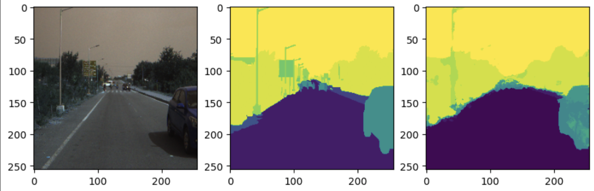

# Semantic Segmentation for Urban Road Scenes

This repository presents a **semantic segmentation** pipeline for urban road scenes using the **U-Net** architecture. The model is trained and evaluated on the **Indian Driving Dataset (IDD)**, with a focus on achieving robust performance under diverse real-world conditions. The project achieved high Intersection over Union (IoU) for key classes such as **Road (85.49%)** and **Sky (83.14%)**.

## Overview

- Implements a **U-Net** based architecture for pixel-level classification of road scene imagery.  
- The model segments scenes into **21 unique classes** including road, vehicles, pedestrians, sky, traffic signs, and more.  
- Integrates **data augmentation** strategies to improve generalization across variations in lighting, occlusions, and weather conditions.

## Dataset

- The **Indian Driving Dataset (IDD)** is tailored for semantic understanding of unstructured driving environments in India.  
- Captured using a front-facing camera mounted on a car, the dataset covers urban and semi-urban areas in and around **Hyderabad** and **Bangalore**.  
- Annotations reflect the complexity of Indian roads, including elements such as auto-rickshaws, animals, and diverse traffic behaviors.

## Sample Output

Below is a sample output illustrating the **original input**, **ground truth annotation**, and the **model’s predicted segmentation mask**:

